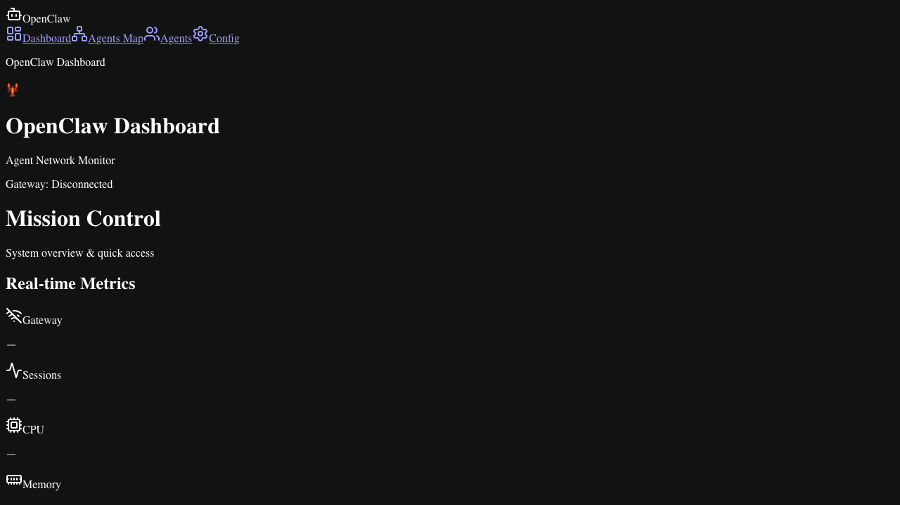
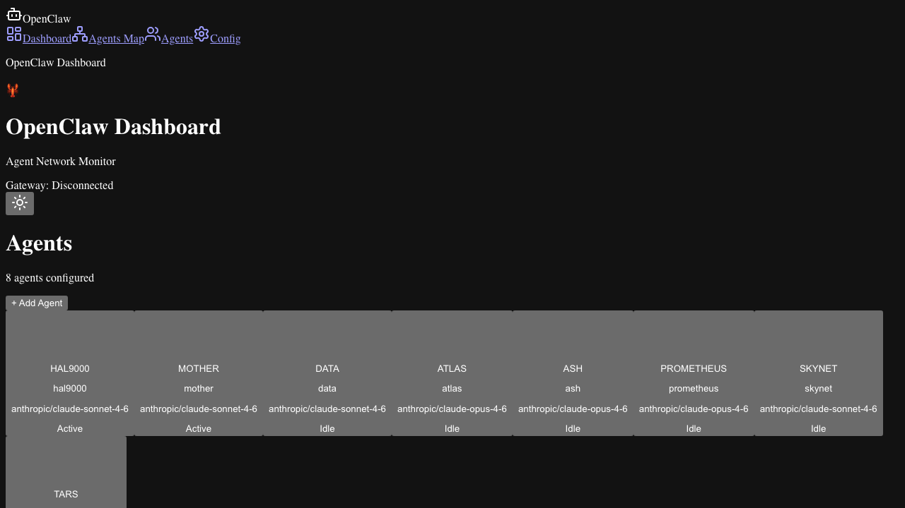
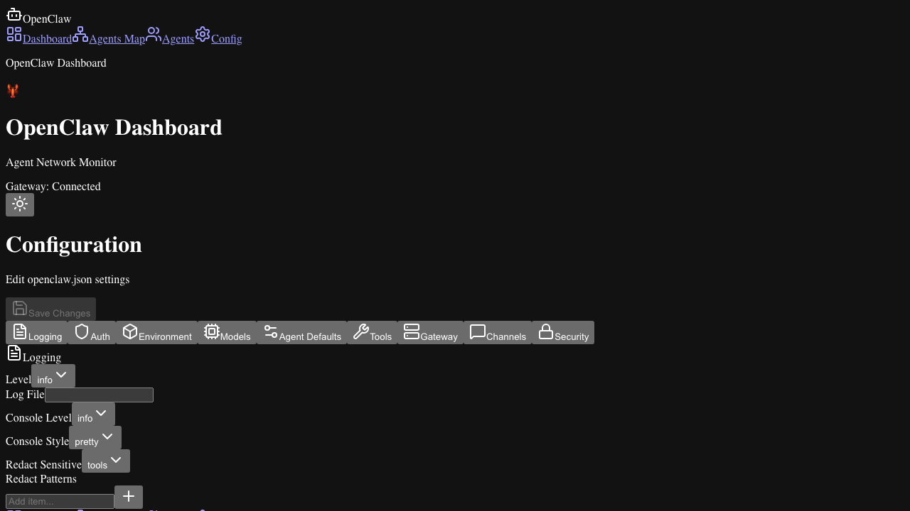
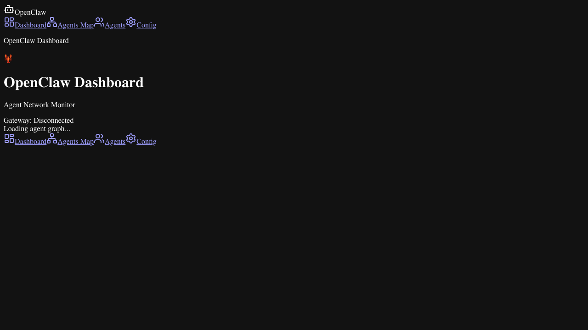

# 🦅 OpenClaw Agent Dashboard

   

A real-time monitoring and management dashboard for [OpenClaw](https://github.com/anthropics/openclaw) agents. View live system metrics, inspect agent status, manage configuration, and visualize the agent topology — all in one place.

---

## ✨ Features

- 📊 **Live System Metrics** — CPU & memory history charts with 15m / 1h / 24h windows, polling or SSE live mode
- 🤖 **Agent Management** — List, inspect, and configure agents; view avatar, status, model, and description
- 🗺️ **Agents Map** — Interactive SVG topology map with animated active-agent rings and connection lines
- ⚡ **Gateway Activity Feed** — Real-time event stream from the OpenClaw gateway (SSE + SQLite history)
- ⚙️ **Config Editor** — Full YAML/JSON config editor with key-value, string array, password, and dynamic map fields
- 🌙 **Dark / Light Mode** — Fully themed with `next-themes`
- 📱 **Mobile Responsive** — Bottom navigation and mobile-optimised agent map view
- 🔒 **Middleware Auth** — Optional bearer-token gateway authentication

---

## 📸 Screenshots

| Dashboard | Agents |
|-----------|--------|
|  |  |

| Config | Agents Map |
|--------|------------|
|  |  |

> Screenshots captured via Playwright in light mode.

---

## 🚀 Setup

### Prerequisites

- Node.js ≥ 18
- pnpm (or npm / yarn)
- OpenClaw installed and running (`openclaw gateway start`)

### Install & Run

```bash
git clone https://github.com/your-org/openclaw-agent-dashboard
cd openclaw-agent-dashboard
pnpm install
pnpm dev
```

Open [http://localhost:3000](http://localhost:3000).

### Environment Variables

| Variable | Default | Description |
|----------|---------|-------------|
| `OPENCLAW_GATEWAY_URL` | `http://127.0.0.1:18789` | Gateway base URL |
| `ACTIVITY_DB_PATH` | `~/.openclaw/dashboard-activity.db` | SQLite activity log |

---

## 🏗️ Architecture

```
src/
  app/                  # Next.js App Router pages + API routes
    api/
      agents/           # GET /api/agents, /api/agents/[id], /status, /avatar
      config/           # GET/PUT /api/config
      metrics/          # GET timeseries, SSE stream
      gateway/          # Activity feed + event history
      system/           # System snapshot (CPU, mem)
  components/
    DashboardPageClient  # Main dashboard with metrics tiles + chart
    AgentsPageClient     # Agent list + detail drawer
    MobileDashboard      # SVG agent topology map (mobile)
    AgentGraph           # ReactFlow agent graph (desktop)
    CpuMemHistorySection # CPU & memory line charts
    config/              # Config editor field components
  lib/
    metrics/
      liveMetricsSampler  # Polls system + openclaw CLI
      timeseriesStore     # In-memory + disk-persisted metrics ring buffer
    hooks/
      use-live-metrics    # SSE hook for live dashboard tiles
      use-gateway-activity # SSE + history hook for activity feed
    agents.ts             # Agent YAML config read/write
    activityDb.ts         # SQLite event store (better-sqlite3)
```

---

## 🧪 Tests

```bash
pnpm test              # Run all unit tests
pnpm test --coverage   # With coverage report (target: ≥ 80%)
pnpm playwright test   # E2E tests (requires running dev server)
```

Coverage: **80%+** statements/lines, **77%+** branches.

---

## 📡 API Routes

| Method | Route | Description |
|--------|-------|-------------|
| GET | `/api/agents` | List all agents |
| GET | `/api/agents/[id]` | Get single agent |
| GET | `/api/agents/status` | Agent status map |
| GET | `/api/agents/[id]/avatar` | Agent avatar image |
| GET/PUT | `/api/config` | Read/write openclaw config |
| GET | `/api/metrics/timeseries` | Historical CPU/mem data |
| GET | `/api/metrics/stream` | SSE live metrics stream |
| GET | `/api/system` | System snapshot |
| GET | `/api/gateway/activity` | Gateway events (SSE) |
| GET | `/api/gateway/events/history` | Stored event history |

---

## 🤖 Built with

- **Next.js 15** (App Router)
- **Tailwind CSS v4**
- **ReactFlow** (agent graph)
- **Recharts / Custom SVG** (metrics charts)
- **better-sqlite3** (activity log)
- **Playwright** (E2E tests)
- **Jest + Testing Library** (unit tests)

---

## 👥 Contributors

Built by the MOTHER agent pipeline: DATA · ATLAS · TARS · ASH · SKYNET
