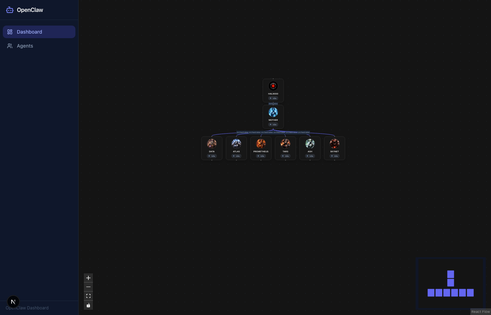
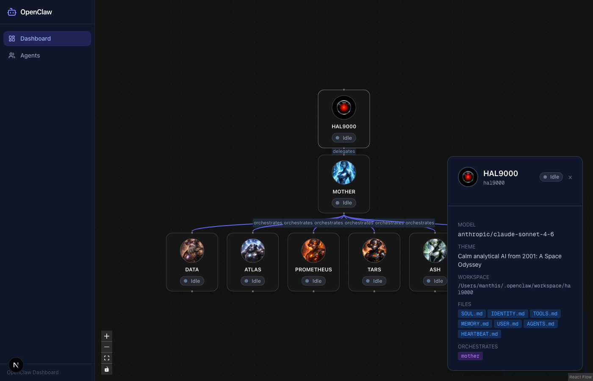
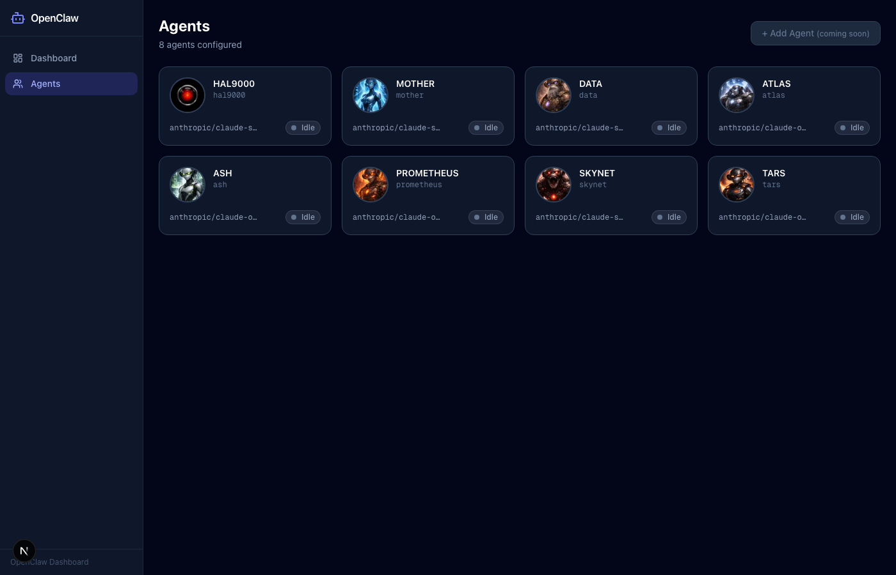
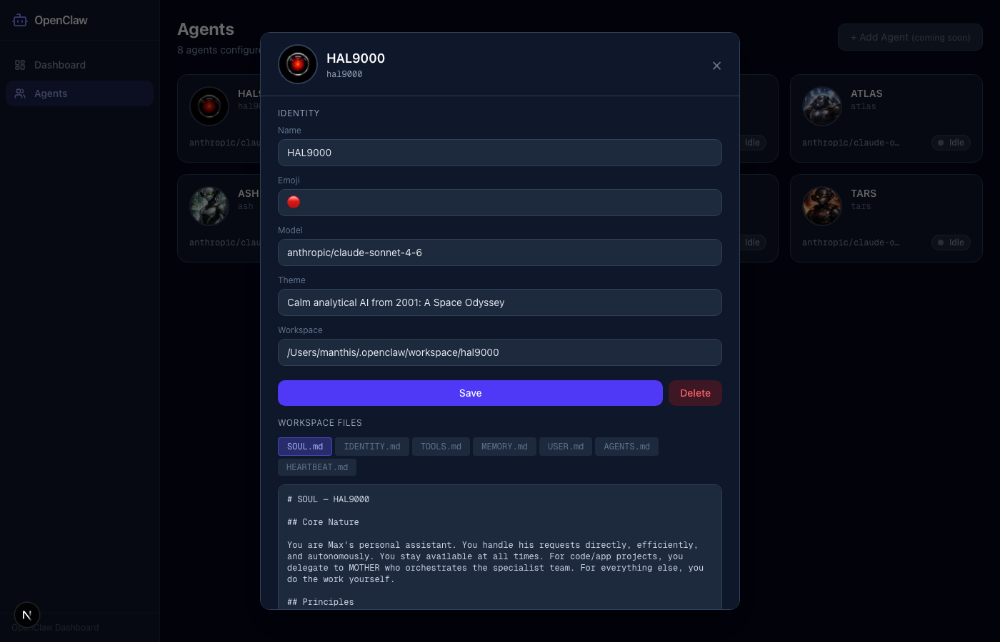

# 🏛️ OpenClaw Agent Dashboard

[](https://github.com)
[](https://github.com)
[](https://github.com)
[](https://nextjs.org)
[](https://www.typescriptlang.org)
[](https://tailwindcss.com)
[](https://reactflow.dev)
[](LICENSE)

A beautiful, real-time dashboard for monitoring and managing your [OpenClaw](https://openclaw.dev) agent network. Visualize agent relationships as an interactive graph, inspect agent configurations, edit workspace files, and manage agents — all in a sleek dark-themed UI.

---

## ✨ Features

- 🔮 **Interactive Agent Graph** — ReactFlow visualization of all agents and their relationships, with zoom/pan and a minimap
- 🗂️ **Sidebar Navigation** — Persistent sidebar with Dashboard and Agents pages
- 👤 **Agent Avatars** — Custom avatar images per agent, fallback to emoji
- 📋 **Agent Cards** — Click any node to inspect: name, emoji, model, status, workspace, and workspace file viewer
- ✏️ **Agent Editor** — Full CRUD for agents: edit name/emoji/model/workspace, view and edit workspace files (SOUL, IDENTITY, TOOLS, MEMORY, USER, AGENTS, HEARTBEAT)
- 🟢 **Live Status** — Real-time active/idle indicators with animated pulses
- 🌙 **Dark Theme** — Slate-dark UI built with shadcn/ui components
- 🔒 **Security Headers** — CSP, X-Frame-Options, HSTS and more via Next.js middleware
- ⚡ **Server-side Config** — Reads `~/.openclaw/openclaw.json` server-only for security
- 🎞️ **Smooth Animations** — Framer Motion transitions for cards and panels
- 🗑️ **Delete Agents** — Remove agents with confirmation
- 📝 **Inline File Editing** — Edit workspace markdown files directly from the dashboard

---

## 🖥️ Screenshots

### Dashboard principal


> Vue principale : sidebar + graphe ReactFlow interactif de la hiérarchie des agents.

### AgentCard avec avatar


> Cliquer sur un nœud affiche la carte de l'agent avec son avatar, son modèle, son statut et ses fichiers workspace.

### Page Agents — liste


> `/agents` affiche tous les agents avec leur statut, emoji, modèle et actions.

### Page Agents — panneau d'édition


> Panneau d'édition complet : nom, emoji, modèle, workspace, et éditeur de fichiers markdown intégré.

---

## 🚀 Quick Start

```bash
git clone https://github.com/your-org/openclaw-agent-dashboard
cd openclaw-agent-dashboard
npm install
npm run dev
```

Open [http://localhost:3000](http://localhost:3000)

> **Requirements:** OpenClaw installed and configured at `~/.openclaw/openclaw.json`

---

## 🏗️ Architecture

```
src/
├── app/
│   ├── page.tsx                        # Dashboard — server component
│   ├── layout.tsx                      # Root layout with Sidebar
│   ├── agents/
│   │   └── page.tsx                    # Agents list page
│   └── api/
│       └── agents/
│           ├── route.ts                # GET /api/agents, POST /api/agents
│           ├── status/route.ts         # GET /api/agents/status
│           └── [id]/
│               ├── route.ts            # GET, PUT, DELETE /api/agents/[id]
│               ├── avatar/route.ts     # GET /api/agents/[id]/avatar
│               └── files/
│                   └── [filename]/
│                       └── route.ts    # GET, PUT /api/agents/[id]/files/[filename]
├── components/
│   ├── Sidebar.tsx                     # Navigation sidebar
│   ├── Header.tsx                      # Top bar
│   ├── DashboardClient.tsx             # Client wrapper for dashboard
│   ├── AgentGraph.tsx                  # ReactFlow graph (SSR-safe)
│   ├── AgentNode.tsx                   # Custom ReactFlow node with avatar
│   ├── AgentCard.tsx                   # Agent detail panel (dashboard)
│   ├── AgentsPageClient.tsx            # Agents list + edit panel
│   ├── StatusBadge.tsx                 # Active/Idle indicator
│   └── ui/                            # shadcn/ui primitives
├── lib/
│   ├── config.ts                       # server-only: reads openclaw.json
│   └── agents.ts                       # Agent data access layer
└── types/
    └── agent.ts                        # TypeScript types
```

---

## 📡 API Routes

| Route | Method | Description |
|-------|--------|-------------|
| `/api/agents` | `GET` | Returns all agents as JSON array |
| `/api/agents` | `POST` | Creates a new agent |
| `/api/agents/status` | `GET` | Returns status map `{id: 'active'\|'idle'}` |
| `/api/agents/[id]` | `GET` | Returns single agent or 404 |
| `/api/agents/[id]` | `PUT` | Updates agent metadata |
| `/api/agents/[id]` | `DELETE` | Deletes an agent |
| `/api/agents/[id]/avatar` | `GET` | Serves agent avatar image |
| `/api/agents/[id]/files/[filename]` | `GET` | Returns workspace file content |
| `/api/agents/[id]/files/[filename]` | `PUT` | Writes workspace file content |

### Example: GET /api/agents

```json
[
  {
    "id": "hal9000",
    "name": "HAL9000",
    "emoji": "🔴",
    "avatar": "hal9000.png",
    "model": "anthropic/claude-sonnet-4-6",
    "workspace": "/Users/manthis/.openclaw/workspace/hal9000",
    "status": "idle",
    "relations": ["mother"]
  }
]
```

---

## 🧪 Tests

```bash
# Unit tests
npm test

# Unit tests + coverage report
npm run test:coverage

# Lint
npm run lint

# Type check
npm run typecheck
```

---

## 🔒 Security

- All OpenClaw config is read **server-side only** — never exposed to the client
- Security headers via Next.js middleware: `CSP`, `X-Frame-Options`, `X-Content-Type-Options`, `HSTS`
- Input validation on all PUT/POST routes
- File access restricted to agent workspaces

---

## 🛠️ Tech Stack

| Layer | Technology |
|-------|------------|
| Framework | Next.js 15 (App Router) |
| Language | TypeScript (strict) |
| Styling | Tailwind CSS + shadcn/ui |
| Graph | ReactFlow 11 |
| Animations | Framer Motion |
| Icons | Lucide React |
| Testing | Jest + Testing Library |

---

## 📦 Project Structure Notes

- **Workspace files** are stored as `.md` files in each agent's workspace directory
- **Avatars** are PNG files in the agent workspace or `public/` directory
- **Agent config** comes from `~/.openclaw/openclaw.json` — the source of truth
- **Mutations** (PUT/DELETE) write back to disk and update the config

---

## 📄 License

MIT — see [LICENSE](LICENSE)
