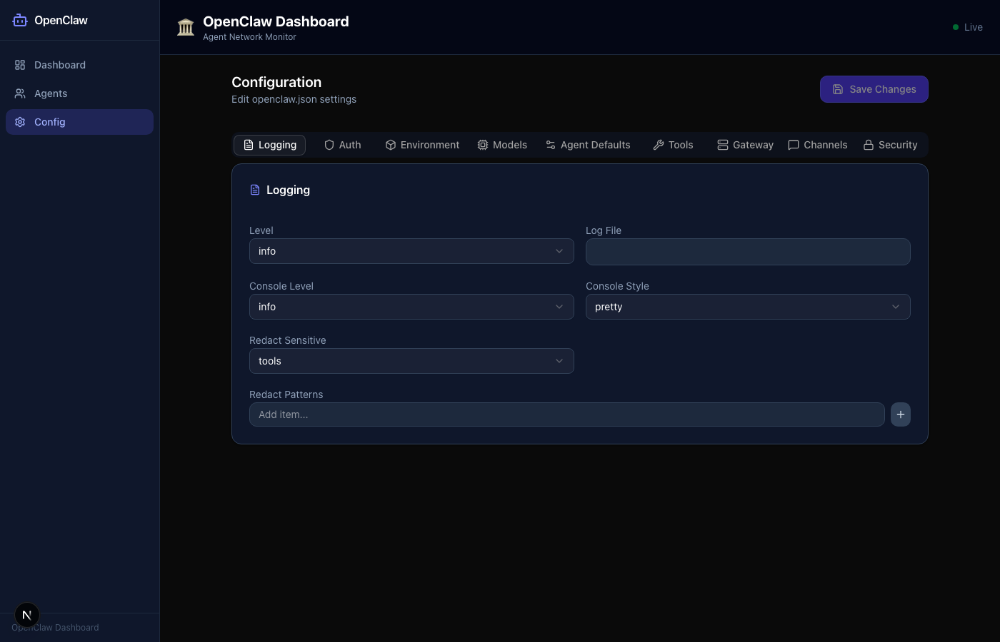

# 🏛️ OpenClaw Agent Dashboard

[](https://github.com)
[](https://github.com)
[](https://github.com)
[](https://nextjs.org)
[](https://www.typescriptlang.org)
[](https://tailwindcss.com)
[](https://reactflow.dev)
[](https://github.com/missive/emoji-mart)
[](LICENSE)

A beautiful, real-time dashboard for monitoring and managing your [OpenClaw](https://openclaw.dev) agent network. Visualize agent relationships as an interactive graph, inspect and edit agent configurations, manage global config, and control your entire agent system — all in a sleek dark-themed UI.

---

## ✨ Features

- 🔮 **Interactive Agent Graph** — ReactFlow visualization of all agents and their relationships, with zoom/pan and a minimap
- 🗂️ **Sidebar Navigation** — Persistent sidebar with Dashboard, Agents, and Config pages
- 👤 **Agent Avatars** — Custom avatar images per agent, fallback to emoji
- 📋 **Agent Cards** — Click any node to inspect: name, emoji, model, status, workspace, and workspace file viewer
- ✏️ **Agent Editor** — Full CRUD for agents: edit name, emoji (picker), model (combobox), workspace (directory picker), and view/edit workspace markdown files (SOUL, IDENTITY, TOOLS, MEMORY, USER, AGENTS, HEARTBEAT)
- 😀 **Emoji Picker** — Rich emoji selection via `emoji-mart` integrated into the agent form
- 🤖 **Model Combobox** — Searchable combobox listing all available models fetched from `/api/models`
- 📁 **Directory Picker** — File system directory picker for agent workspace selection
- 🔗 **Agent Multi-Select** — Link/unlink agents with multi-select component
- 🟢 **Live Status** — Real-time active/idle indicators with animated pulses
- ⚙️ **Config Page** — Full OpenClaw config editor with structured fields: key-value pairs, string arrays, password fields, dynamic map editor, and section cards
- 🌙 **Dark Theme** — Slate-dark UI built with shadcn/ui components
- 🔒 **Security Headers** — CSP, X-Frame-Options, HSTS and more via Next.js middleware
- ⚡ **Server-side Config** — Reads `~/.openclaw/openclaw.json` server-only for security
- 🎞️ **Smooth Animations** — Framer Motion transitions for cards and panels
- 🗑️ **Delete Agents** — Remove agents with confirmation
- 📝 **Inline File Editing** — Edit workspace markdown files directly from the dashboard

---

## 🖥️ Screenshots

### Dashboard principal


> Vue principale : sidebar + graphe ReactFlow interactif de la hiérarchie des agents.

### AgentCard avec avatar


> Cliquer sur un nœud affiche la carte de l'agent avec son avatar, son modèle, son statut et ses fichiers workspace.

### Page Agents — liste


> `/agents` affiche tous les agents avec leur statut, emoji, modèle et actions.

### Page Agents — panneau d'édition


> Panneau d'édition complet : emoji picker, model combobox, directory picker, et éditeur de fichiers markdown intégré.

### Page Config


> `/config` expose tous les paramètres OpenClaw : clé/valeur, tableaux, maps dynamiques, mots de passe.

---

## 🚀 Quick Start

```bash
git clone https://github.com/your-org/openclaw-agent-dashboard
cd openclaw-agent-dashboard
npm install
npm run dev
```

Open [http://localhost:3000](http://localhost:3000)

> **Requirements:** OpenClaw installed and configured at `~/.openclaw/openclaw.json`

---

## 🏗️ Architecture

```
src/
├── app/
│   ├── page.tsx                        # Dashboard — server component
│   ├── layout.tsx                      # Root layout with Sidebar
│   ├── agents/
│   │   └── page.tsx                    # Agents list page
│   ├── config/
│   │   └── page.tsx                    # Config page
│   └── api/
│       ├── agents/
│       │   ├── route.ts                # GET /api/agents, POST /api/agents
│       │   ├── status/route.ts         # GET /api/agents/status
│       │   └── [id]/
│       │       ├── route.ts            # GET, PUT, DELETE /api/agents/[id]
│       │       ├── avatar/route.ts     # GET /api/agents/[id]/avatar
│       │       └── files/
│       │           └── [filename]/
│       │               └── route.ts    # GET, PUT /api/agents/[id]/files/[filename]
│       ├── config/
│       │   └── route.ts               # GET, PUT /api/config
│       └── models/
│           └── route.ts               # GET /api/models
├── components/
│   ├── Sidebar.tsx                     # Navigation sidebar (Dashboard / Agents / Config)
│   ├── Header.tsx                      # Top bar
│   ├── DashboardClient.tsx             # Client wrapper for dashboard
│   ├── AgentGraph.tsx                  # ReactFlow graph (SSR-safe)
│   ├── AgentNode.tsx                   # Custom ReactFlow node with avatar
│   ├── AgentCard.tsx                   # Agent detail panel (dashboard)
│   ├── AgentsPageClient.tsx            # Agents list + edit panel
│   ├── StatusBadge.tsx                 # Active/Idle indicator
│   ├── agents/
│   │   ├── AgentMultiSelect.tsx        # Multi-select for agent linking
│   │   ├── DirectoryPickerField.tsx    # FS directory picker input
│   │   ├── EmojiPickerField.tsx        # emoji-mart powered emoji selector
│   │   ├── ModelComboBox.tsx           # Searchable model selector
│   │   └── ModelMultiSelect.tsx        # Multi-select for models
│   ├── config/
│   │   ├── ConfigPageClient.tsx        # Config page client
│   │   ├── DynamicMapEditor.tsx        # Key-value map editor
│   │   ├── KeyValueEditor.tsx          # Generic key-value editor
│   │   ├── PasswordField.tsx           # Masked password input
│   │   ├── SectionCard.tsx             # Config section card wrapper
│   │   └── StringArrayEditor.tsx       # Array of strings editor
│   └── ui/                            # shadcn/ui primitives
```

---

## 🛠️ Tech Stack

| Layer | Technology |
|-------|------------|
| Framework | [Next.js 15](https://nextjs.org) (App Router, Server Components) |
| Language | TypeScript (strict) |
| Styling | Tailwind CSS + [shadcn/ui](https://ui.shadcn.com) |
| Graph | [@xyflow/react](https://reactflow.dev) (ReactFlow v11) |
| Emoji | [emoji-mart](https://github.com/missive/emoji-mart) + `@emoji-mart/react` + `@emoji-mart/data` |
| Animations | [Framer Motion](https://www.framer.com/motion/) |
| Icons | [Lucide React](https://lucide.dev) |
| UI Primitives | [Radix UI](https://www.radix-ui.com) |
| Runtime | Node.js (server-side config access) |

---

## 🔐 Security

- All OpenClaw config is read **server-side only** — never exposed to the browser
- Next.js middleware enforces: `CSP`, `X-Frame-Options: DENY`, `X-Content-Type-Options`, `HSTS`
- API routes validate all inputs before writing to disk
- `server-only` package enforced on config access utilities

---

## 📄 License

MIT — see [LICENSE](LICENSE)
